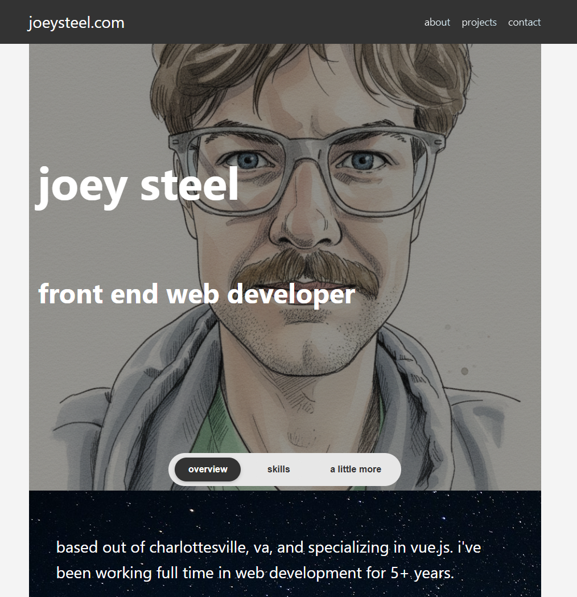

# 2025 Portfolio

Welcome to my 2025 Portfolio! (yes, it is no longer 2025 but this was the name I chose, so I'm sticking with it) This project showcases my recent work, skills, and projects in a modern, responsive web application.

## 📸 Screenshot



## 🛠️ Tech Stack

This project is built using modern web development technologies:

- **Framework:** [Vue.js 3](https://vuejs.org/) (Composition API)
- **Routing:** [Vue Router 4](https://router.vuejs.org/)
- **Build Tool:** [Vite](https://vitejs.dev/)
- **Styling:** Vanilla CSS
- **Testing:** [Vitest](https://vitest.dev/) & [Vue Test Utils](https://test-utils.vuejs.org/)
- **Formatting & Linting:** ESLint & Prettier

## 🚀 How to Run Locally

Follow these instructions to get a copy of the project up and running on your local machine for development and testing purposes.

### Prerequisites

- [Node.js](https://nodejs.org/) (version 20.19.0+ or 22.12.0+)
- npm (comes with Node.js)

### Installation

1. Clone the repository (if you haven't already):

   ```bash
   git clone <repository-url>
   cd 2025-portfolio
   ```

2. Install the dependencies:
   ```bash
   npm install
   ```

### Running the Development Server

Start the development server with hot-reload:

```bash
npm run dev
# OR
npm start
```

The application will be available at your local host output provided by Vite (typically `http://localhost:5173`).

### Building for Production

To create a production-ready build:

```bash
npm run build
```

### Running Tests

To run the unit tests using Vitest:

```bash
npm run test:unit
```
